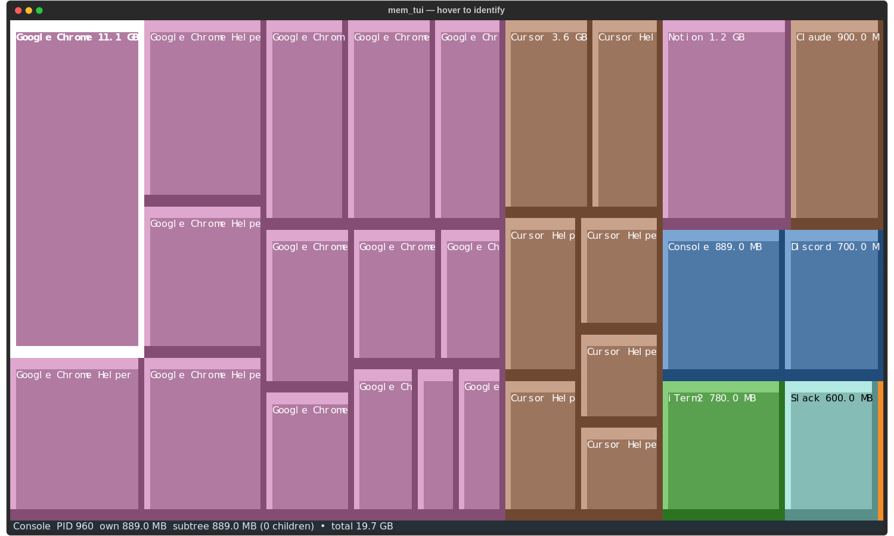
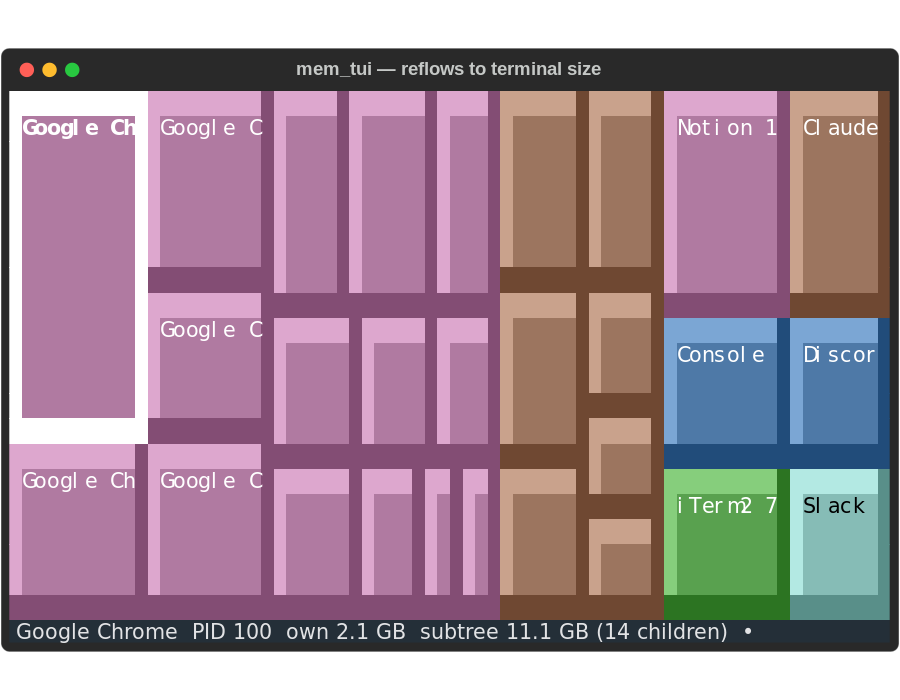
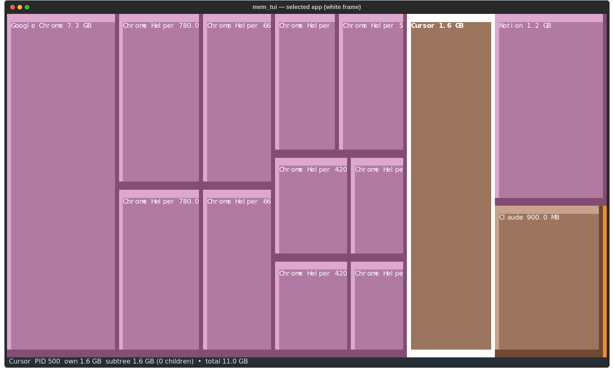
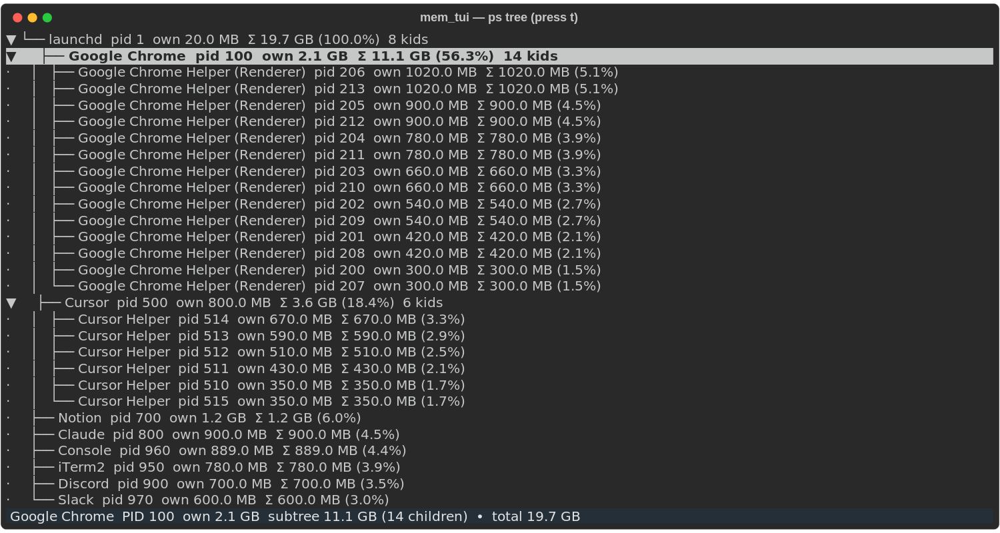
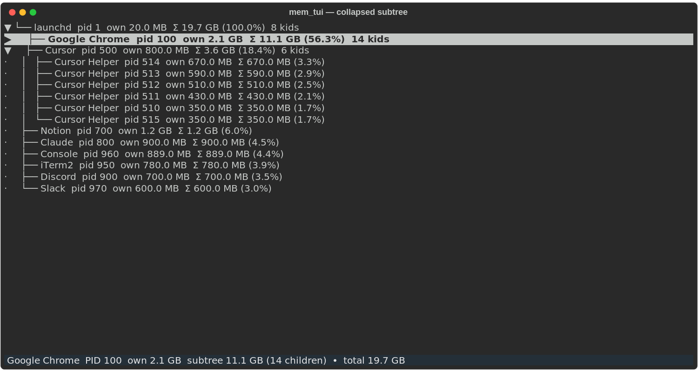
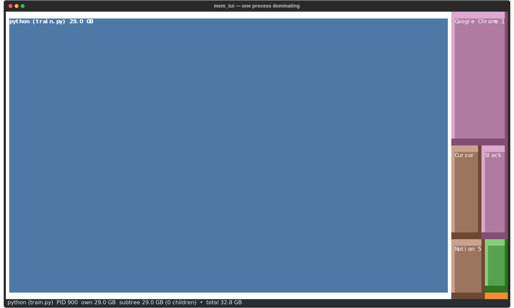
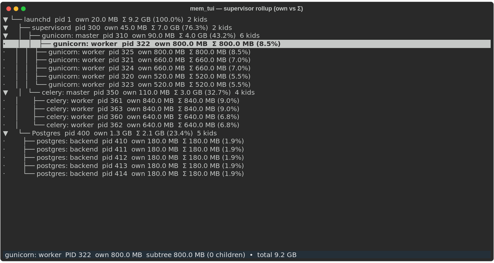
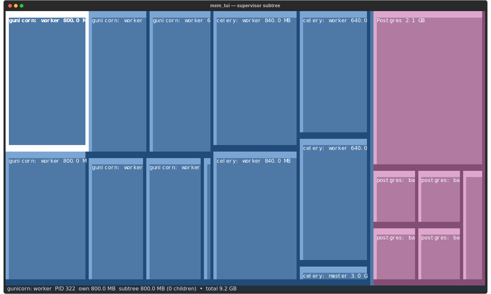

# mem_tui

[](https://github.com/bossjones/mem_tui/actions/workflows/ci.yml)


Async-first terminal UI that renders a **squarified treemap of process memory
usage on macOS** — a GrandPerspective-style segmented view, but for RAM.

Memory is rolled up the process tree, so a parent (e.g. `Google Chrome`, `node`,
a supervisor) shows the total of itself plus all descendants. Answer "which
process is eating all my memory?" at a glance. See [how it works](docs/ARCHITECTURE.md)
for the pipeline that turns a process snapshot into the view on screen.

Two views, toggled with **t**:

- **[Treemap](#treemap-view)** — squarified, beveled tiles sized by subtree
  memory and colored by application. Hover any tile to read its process in the
  status bar.
- **[Tree](#tree-view)** — a scrollable ps-style hierarchy showing each process
  indented under its parent, with own RSS, subtree total + percent of all
  memory, and child counts.

Both views share the same live samples, selection, and collapse state.

## Screenshots

### Treemap view

Treemap view — beveled tiles sized by subtree memory, colored by application:


Hover any tile to read its process in the status bar:



The layout reflows live to your terminal size:



Keyboard-select any application to highlight it with a white frame:



### Tree view

ps-tree view (press `t`) — hierarchy with own RSS, subtree total, and share:



Collapse a subtree (see [Collapse/Expand](#keys)) to roll its memory into the
parent:



### Spot the memory hog

Spot a runaway process instantly — here `python (train.py)` at 29 GB swallows
the whole view:



### Supervisor rollup — own vs. subtree

A `supervisord` / `gunicorn` / `celery` stack where each parent's
[own RSS is tiny but its subtree RSS is large](docs/superpowers/specs/2026-06-30-mem-tui-design.md#definitions)
— the original "which supervisor is eating memory?" question, in Tree view:



The same stack in Treemap view:



## Run

```bash
uv run mem_tui.py
```

Or install it as a CLI (`mem-tui = "mem_tui.app:main"`):

```bash
uv tool install .
mem-tui
```

## Keys

| Key                       | Action                                          |
| ------------------------- | ------------------------------------------------ |
| `enter` / click a tile    | Collapse/Expand a subtree (roll children into the parent) |
| `tab` / `→` / `↓`         | Move selection to next                          |
| `shift+tab` / `←` / `↑`   | Move selection to prev                          |
| `t`                       | Toggle Treemap / Tree view                      |
| `m`                       | Toggle mouse on/off                             |
| `r`                       | Force refresh                                   |
| `space`                   | Pause/resume auto-refresh                       |
| `q`                       | Quit                                            |

Hovering a tile (mouse, treemap only) updates the status bar without changing
selection.

Building from source or running tests? See [Develop](#develop) below.

## Develop

```bash
uv sync
uv run pytest
uv run ruff check .
uv run ruff format --check .
uv run pyright
```

For architecture and contribution guidance, see [CLAUDE.md](CLAUDE.md) and
[docs/ARCHITECTURE.md](docs/ARCHITECTURE.md).
