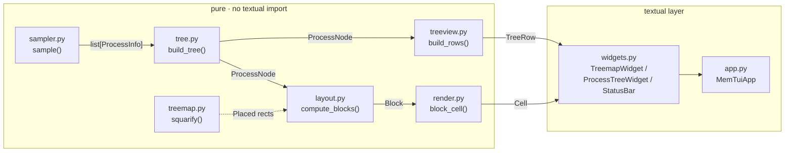

# Architecture

Canonical reference for the data pipeline, module responsibilities, and data
models in `mem_tui`. See [README.md](../README.md) for usage and screenshots,
and the [design spec](superpowers/specs/2026-06-30-mem-tui-design.md) for the
original goals, non-goals, and testing strategy.

## Pipeline

A strict one-directional pipeline. Everything up to `widgets.py` is **pure and
Textual-free**, which is what makes it testable without a terminal — `widgets.py`
is the first module allowed to `import textual`.

- **`models.ProcessInfo`** — frozen snapshot of one process. No dependencies;
  the shared currency between sampler and tree.
- **`sampler.sample()`** — async; offloads the blocking `psutil.process_iter()`
  to `asyncio.to_thread` so the event loop never stalls. Processes that vanish
  or deny access mid-scan are silently skipped.
- **`tree.build_tree()`** — turns the flat list into a `ProcessNode` tree under
  a synthetic root at pid 0. Orphans and cycles both attach to the root, so it
  never hangs.
- **`treemap.squarify()`** — pure squarified-treemap geometry
  (Bruls/Huizing/van Wijk). A helper consumed by `layout.py`, not a pipeline
  stage of its own.
- **`layout.compute_blocks()`** — bridges tree + collapse-state + rect into
  drawable `Block`s.
- **`treeview.build_rows()`** — the alternate view: a depth-first `TreeRow`
  list with branch-glyph prefixes.
- **`render.block_cell()`** — pure per-cell styling (bevel, selection frame,
  contrast text).
- **`widgets.py`** — the only Textual layer below the app; renders `Block`s and
  `TreeRow`s, posts UI messages (`BlockClicked`, `BlockHovered`, `Resized`).
- **`app.MemTuiApp`** — owns all mutable UI state and re-runs the pipeline via
  `_recompute()` on every state change.

## Module responsibilities

| Module                  | Responsibility                                                                                          | Pure / Textual-free? |
| ------------------------ | --------------------------------------------------------------------------------------------------------- | --------------------- |
| `models.py`     | `ProcessInfo` frozen dataclass — pid, ppid, name, rss, cmdline                                          | Yes, no deps          |
| `sampler.py`    | Async `sample()`; psutil enumeration via `asyncio.to_thread`; skips vanished/access-denied processes    | Yes                    |
| `tree.py`       | `build_tree()` — flat list → `ProcessNode` tree under synthetic root pid 0; orphan/cycle handling; bottom-up subtree RSS rollup; `top_level_ancestor()` color-group lookup | Yes |
| `treemap.py`    | `squarify()` — pure squarified-treemap geometry: `(id, weight)` pairs + `Rect` → `Placed`               | Yes                    |
| `layout.py`     | `compute_blocks()` — tree + collapse-state + rect → `Block`s (a "self" slice for expanded nodes, one leaf block for collapsed/childless nodes); `block_at()` hit-testing | Yes |
| `treeview.py`   | `build_rows()` — depth-first `TreeRow` list, sorted by subtree RSS descending, with branch-glyph prefixes | Yes                    |
| `render.py`     | `block_cell()` — 3D bevel, white selection frame, luminance-based text contrast                          | Yes                    |
| `colors.py`     | `color_for()` — stable hex from a 12-color curated palette, keyed by `ancestor_pid % 12`                 | Yes                    |
| `format.py`     | `human_bytes()` — B/KB/MB/GB/TB/PB formatting                                                            | Yes                    |
| `widgets.py`    | `TreemapWidget`, `ProcessTreeWidget`, `StatusBar` — only Textual layer below `app`                       | No (Textual)           |
| `app.py`        | `MemTuiApp` — owns UI state, `_recompute()`, `refresh_data()` timer loop                                  | No (Textual)           |

## Data models

| `ProcessInfo` (`models.py`) | Type   |
| ----------------------------- | ------ |
| `pid`                        | `int`  |
| `ppid`                       | `int`  |
| `name`                       | `str`  |
| `rss`                        | `int`  |
| `cmdline`                    | `str`  |

| `ProcessNode` (`tree.py`, mutable) | Type                |
| ------------------------------------ | ------------------- |
| `info`                              | `ProcessInfo`        |
| `children`                          | `list[ProcessNode]`  |
| `subtree_rss`                       | `int`                |

| `Rect` / `Placed` (`treemap.py`) | Type                          |
| ----------------------------------- | ------------------------------ |
| `Rect.x, y, w, h`                  | `float` (cell coordinates)     |
| `Placed.item_id, rect`             | `id, Rect`                     |

| `Block` (`layout.py`) | Type                  |
| ------------------------ | --------------------- |
| `pid`                   | `int`                  |
| `name`                  | `str`                  |
| `color`                 | `str` (hex)            |
| `own_rss`               | `int`                  |
| `subtree_rss`           | `int`                  |
| `child_count`           | `int`                  |
| `kind`                  | `"leaf"` \| `"self"`   |
| `rect`                  | `Rect`                 |

| `TreeRow` (`treeview.py`) | Type   |
| ---------------------------- | ------ |
| `pid`                        | `int`  |
| `depth`                      | `int`  |
| `name`                       | `str`  |
| `own_rss`                    | `int`  |
| `subtree_rss`                | `int`  |
| `child_count`                | `int`  |
| `collapsed`                  | `bool` |
| `prefix`                     | `str`  |

`own_rss` is one process's resident memory; `subtree_rss` is own + all
descendants', recursively — the value that drives treemap block size. See
[Definitions](superpowers/specs/2026-06-30-mem-tui-design.md#definitions) in
the design spec for the full rationale.

## Key invariants

- The synthetic root has pid `0`; orphans (missing parent) and ppid cycles
  both attach to it, so tree-building never hangs.
- `top_level_ancestor()` walks up to the first ancestor whose parent is a
  boundary ppid (`{0, 1}` — synthetic root and launchd/init), so each app under
  launchd gets its own color instead of all sharing launchd's.
- Color is `ancestor_pid % 12` against the fixed palette in `colors.py`.
- `app._recompute()` re-runs layout + treeview from the current tree/collapse
  state and re-renders on every state change (collapse, selection, refresh).
- A refresh that yields zero processes keeps the previous frame rather than
  blanking the screen.

## See also

- [README.md](../README.md) — usage, screenshots, keybindings.
- [CLAUDE.md](../CLAUDE.md) — working agreements for Claude Code in this repo.
- [Design spec](superpowers/specs/2026-06-30-mem-tui-design.md) — original
  goals, non-goals, definitions, error handling, and testing strategy.
